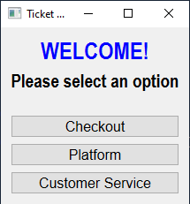
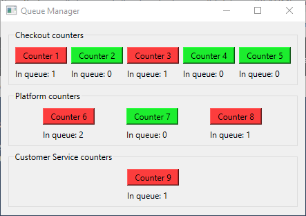
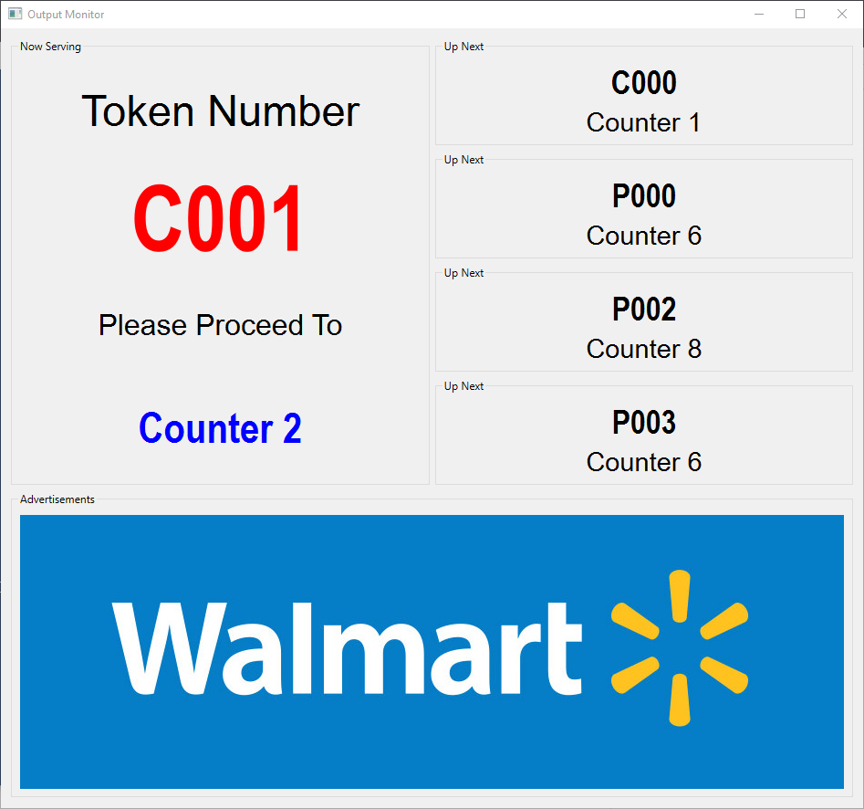

# Bank Queue Management System (BQMS)
Tihs assignment is about a queue management system in a bank, to organize and visualize shifts in a virtual queue. It has tree main sections: the ticket vending machine, a queue manager and an output monitor for visualizing current and future tickets to be attended.

## Getting Started

### Prerequisites
You need Python 3.x to run the project. 
In Ubuntu, Mint and Debian you can install Python 3 like this.

```bash
sudo apt-get install python3 python3-pip
```

For other Linux flavors, macOS and Windows, packages are available at

  https://www.python.org/getit/

### Installation
Use the package [pip](https://pip.pypa.io/en/stable/) to install the requirements.

```bash
pip install -r requirements.txt
```

## Usage 
Inside the [src](https://github.com/hdezmariela/bank_virtual_queue/tree/main/src) you will find the three main python files.

- Run ticket vending machine GUI
```bash
python ticket_station.py
```
- Run queue manager GUI
```bash
python queue_manager.py
```
- Run output monitor GUI
```bash
python output_monitor.py
```

## User Interface
As previously mentioned, this queue management system consists of three main sections, each one has a GUI. Will be shown below.

### Ticket Station
The ticket station allows you to get a ticket for a specific service from the bank. There are three available services: 

### Queue Manager

### Output Monitor

